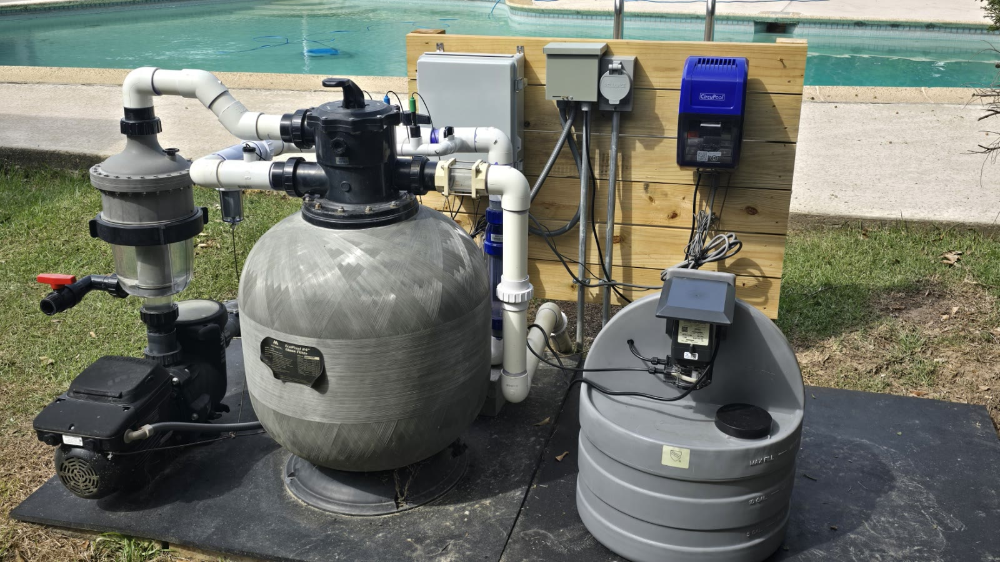
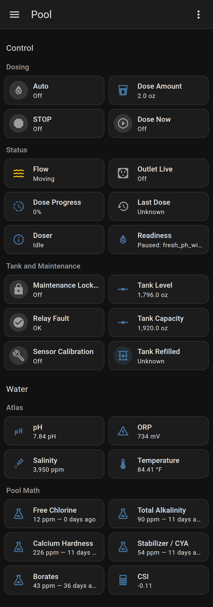
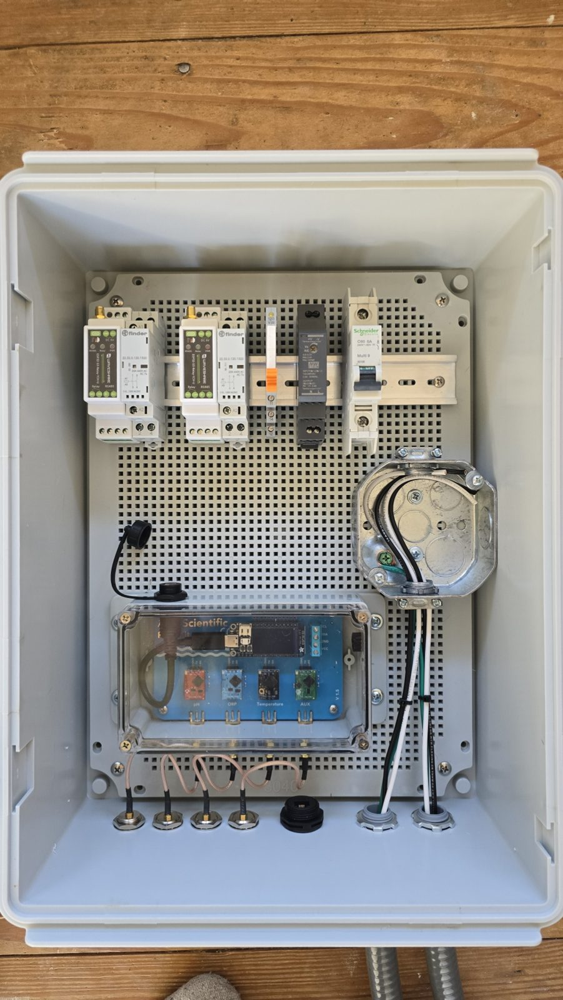
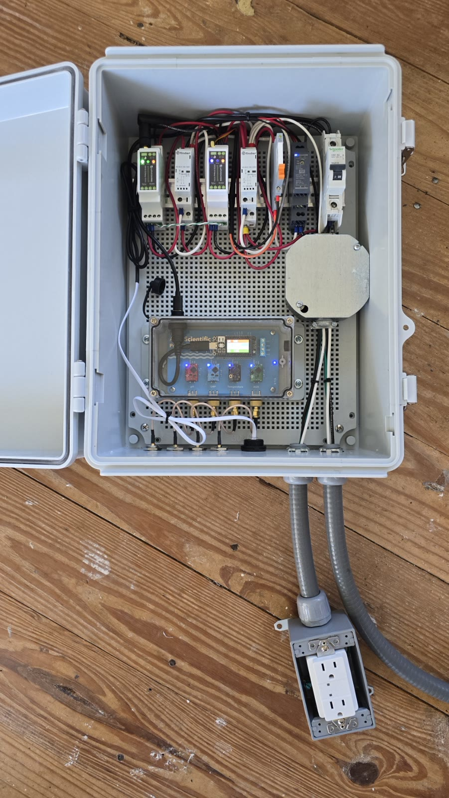
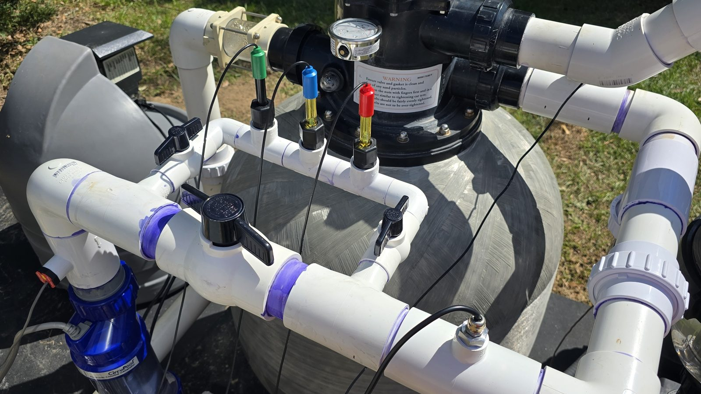
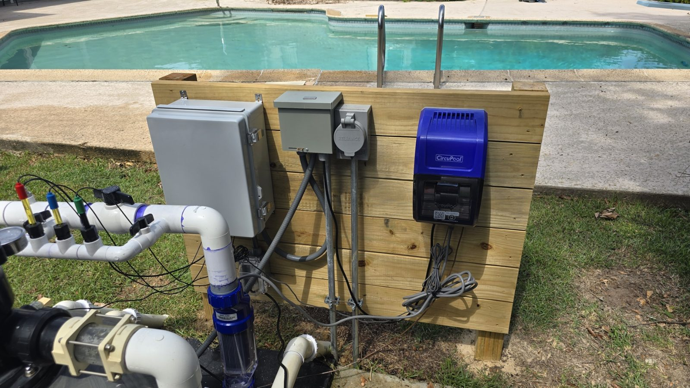
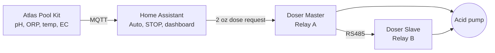

# Pool Autopilot

**One place for everything your pool is doing.** Pool Autopilot brings live
water sensors, automatic pH control and your own manual test results together
in Home Assistant, on one dashboard on your phone or desktop. Sensing and
dosing run locally, with no subscription.

Built by **[Bitwise Anvil LLC](https://bitwiseanvil.com/)**. If you like what
you see, [let's talk](#work-with-bitwise-anvil) about what we can build for you.



## What it does

- **Watches the water around the clock.** Atlas Scientific probes measure pH,
  ORP, temperature, conductivity, salinity and TDS, shown on a built-in screen
  and in Home Assistant.
- **Keeps pH on target automatically.** When the average pH rises above 7.80,
  Home Assistant requests one small 2 oz acid pulse, waits for it to mix and
  checks again.
- **Brings in your manual tests.** Log a test in the Pool Math app on your
  phone and it appears in Home Assistant within minutes: free chlorine,
  alkalinity, calcium hardness, stabilizer and borates, each with how many days
  ago it was tested.
- **Calculates water balance live.** A live CSI combines the probes' pH,
  temperature and salt with your latest test results, so you see whether the
  water leans toward scaling or corrosion right now, not just on test day.
- **Tracks the acid tank.** An estimate of the acid left, with level correction
  and one tap after a refill.
- **Guides probe calibration** step by step from the dashboard.
- **Fails safe.** Two controllers each switch their own contactor, so either
  one can cut pump power. Every dose first checks water flow, fresh readings
  and both relays. After a power or Wi-Fi outage it stops, then resumes by
  itself once every check passes.
- **Built to last and tested.** Runtime state lives in RAM so the devices don't
  wear out their memory, and every change runs through native C++ tests and
  Home Assistant scenarios in throwaway containers.

## From reactive to proactive

Because every reading and every test lands in Home Assistant, the pool can tell
you what it needs instead of waiting for you to notice. Home Assistant can
send a phone notification, email or text message when, for example:

- a test is overdue, such as free chlorine not tested in three days;
- a reading drifts out of range, such as ORP falling or salinity running low;
- CSI moves toward scaling or corrosion;
- the acid tank runs low, water flow stops or the doser reports a fault;
- a weekly summary of the water is due.

These alerts are not part of this repository yet. They show where the platform
goes next, and they are the kind of work [Bitwise Anvil](#work-with-bitwise-anvil)
builds for clients.

> [!CAUTION]
> This project pumps acid and switches 120 V mains power. Read
> [Safety](#safety) before you build it.

## What's inside

| Part | What it does | Guide |
| --- | --- | --- |
| **Atlas Pool Kit** | ESP32-S3 sensor with Atlas Scientific EZO circuits. Measures the water, shows it on a small screen and publishes it to Home Assistant over MQTT. Monitor only; it never commands the doser. | [Atlas Pool Kit](atlas-pool-kit/README.md) |
| **Pool Doser** | Drives a Stenner peristaltic pump. A Wi-Fi Master and an RS485 Slave each control one of two series contactors, with flow, relay-proving, runtime and communication interlocks on every dose. | [Pool Doser](pool-doser/README.md) |
| **Home Assistant** | A package and a **Pool** dashboard that add Auto, STOP, manual doses, a tank estimate, live readings and guided calibration. Setup only adds; it never changes your existing dashboards. | [Setup guide](home-assistant/README.md) |
| **Pool Math** *(optional)* | Pulls your test results from a [Pool Math](https://www.troublefreepool.com/) share link and calculates a live CSI from the Atlas readings. | [Pool Math](home-assistant/pool-math.md) |

## See it

The **Pool** dashboard on a desktop and a phone:

<p align="center">
  
  
</p>

The build, from bare panel to finished install:

<p align="center">
  
  
</p>
<p align="center">
  
  
</p>

## How it works



1. The Atlas Pool Kit publishes timestamped readings. Home Assistant accepts
   only fresh ones.
2. While **Auto** is On and the two-minute average pH is above **7.80**, Home
   Assistant requests one **2 oz** pulse.
3. The doser independently rechecks flow, mixing and rest waits, reading
   freshness, calibration and both relays before the pump runs. It enforces its
   own runtime limits even if Home Assistant or Wi-Fi goes away.
4. **STOP** cancels a running dose immediately. Turning Auto Off only prevents
   new automatic doses.

After an ordinary power or network outage the system recovers on its own once
fresh checks pass. It never resumes or replays an interrupted dose. The
[design and safety](docs/design-and-safety.md) document covers the interlocks,
time and freshness rules, recovery, flash writes and the tank estimate.

## Hardware

The [parts list](BOM.md) covers the whole pad, from probes and acid tank to
the salt cell and enclosure. In short:

- **Atlas Pool Kit:** Adafruit Feather ESP32-S3 TFT with Atlas Scientific
  EZO-pH, EZO-ORP, EZO-RTD and EZO-EC circuits and probes.
- **Pool Doser:** two ESP32-S3 relay boards, two motor-rated contactors, an
  outlet-voltage detector, a flow switch, an RS485 link and a 5 V supply.
  See the [bill of materials](pool-doser/BOM.md) and the
  wiring documents in the [Pool Doser guide](pool-doser/README.md).
- **Home Assistant** 2026.9 or later and an MQTT broker such as Mosquitto.
- **Around the pad:** a Stenner 15-gallon acid tank and pump, a CircuPool
  RJ-60 Plus salt cell, a zinc anode and an IP67 enclosure that holds the
  doser and the Atlas kit together.

The reference doser's neutral branches at two Finder contactor terminals exceed
the terminal rating; the [wiring schedule](pool-doser/docs/wiring-schedule.md)
explains what to use instead.

## Get started

1. **Parts:** gather everything on the [parts list](BOM.md).
2. **Atlas Pool Kit:** copy `secrets.example.yaml` to `secrets.yaml`, fill it
   in, then build and flash the firmware as described in the
   [Atlas Pool Kit guide](atlas-pool-kit/README.md).
3. **Pool Doser:** fill in its secrets, build and flash both the Master and the
   Slave, and commission it **with water only**, following the
   [Pool Doser guide](pool-doser/README.md).
4. **Home Assistant:** follow the [setup guide](home-assistant/README.md) to
   add the packages, custom integrations and dashboard, add both devices and
   open the Pool dashboard. Auto starts Off; turn it On only after you have
   verified the installation.

`secrets.yaml` files are ignored by Git; keep credentials out of commits.

## Safety

> [!WARNING]
> **Use at your own risk. This project doses acid and switches mains power.**
>
> The Pool Doser automatically pumps acid, such as muriatic acid, into a
> swimming pool and controls 120 V AC equipment. Mistakes in wiring,
> configuration, calibration or software can over-dose or under-dose chemicals,
> damage equipment, harm swimmers, or cause electric shock or fire. Acid can
> cause severe burns and releases harmful fumes.
>
> This project was designed and written with substantial help from AI tools.
> Although it includes safety interlocks and automated tests, it has not been
> independently reviewed, certified or tested beyond the author's own
> installation, and it may contain errors. It is shared for education and
> reference, not as a finished product.
>
> Before relying on anything here, review the design and code yourself, follow
> local electrical and pool codes, have mains wiring done or inspected by a
> qualified electrician, wear proper protective equipment when handling acid,
> and test your water independently. Never leave a new installation dosing
> unattended until you have verified it thoroughly. You alone are responsible
> for how you build, install and operate it. The software is provided "as is",
> without warranty of any kind, and the author accepts no liability for any
> damage, injury or loss resulting from its use.

## Development and testing

The tools need Python 3 with ESPHome installed at the version pinned in
[`requirements.txt`](requirements.txt), plus `g++` for the native tests.
The Home Assistant checks also need Docker.

```sh
python3 -m venv ~/esphome-venv
~/esphome-venv/bin/pip install -r requirements.txt
export POOL_ESPHOME_PYTHON=~/esphome-venv/bin/python
```

The wrappers use `python3` unless `POOL_ESPHOME_PYTHON` names another
interpreter. Run them from the repository root:

```sh
./tools/esphome version
./tools/esphome config atlas-pool-kit/atlas-pool-kit.yaml
./tools/esphome compile atlas-pool-kit/atlas-pool-kit.yaml
./tools/esphome compile pool-doser/pool-doser.yaml
./tools/esphome compile pool-doser/pool-doser-slave.yaml
./tools/test-atlas
./tools/test-doser
```

`config` validates a configuration and `compile` builds firmware without
uploading it. Both need a filled-in `secrets.yaml`; the example values are
rejected. Compile once before running `./tools/test-atlas`: its flash-write
audit reads the ESP-IDF sources that the first build downloads.
`./tools/test-atlas --container` and `./tools/test-doser --container` also run
the Home Assistant checks in throwaway Docker containers.
`"$POOL_ESPHOME_PYTHON" tests/test_pool_math.py` checks the Pool Math package
the same way. These checks use `ghcr.io/home-assistant/home-assistant:stable`
unless `POOL_HA_IMAGE` names another image; they never touch a running
installation. `tools/requirements.txt` adds an optional PDF utility for the
wiring documents.

The native tests use AddressSanitizer, UndefinedBehaviorSanitizer and
LeakSanitizer. Some sandboxes block LeakSanitizer; that is an environment
limitation, not a reason to disable the checks. After a toolchain upgrade, run
both suites and all three firmware builds.

## Work with Bitwise Anvil

Pool Autopilot is built by **[Steven Cheatham](https://stevencheatham.com/)**
of **[Bitwise Anvil LLC](https://bitwiseanvil.com/)** — *Precision software,
forged at AI speed.*

Pool Autopilot is a working example of what we do: dependable, thoroughly
tested systems, engineered with AI and built to last. Bitwise Anvil offers
systems architecture, advisory, custom development, custom web development,
AI agents and system audits.

- **Work with Bitwise Anvil:** [bitwiseanvil.com](https://bitwiseanvil.com/) ·
  [contact@bitwiseanvil.com](mailto:contact@bitwiseanvil.com)
- **Connect with Steven:** [LinkedIn](https://www.linkedin.com/in/stevencheatham/) ·
  [X](https://x.com/StevenCheatham) ·
  [steven@stevencheatham.com](mailto:steven@stevencheatham.com)

If this project helped you, a ⭐ on GitHub helps others find it.

## License

[MIT](LICENSE). Use it at your own risk; see [Safety](#safety).
