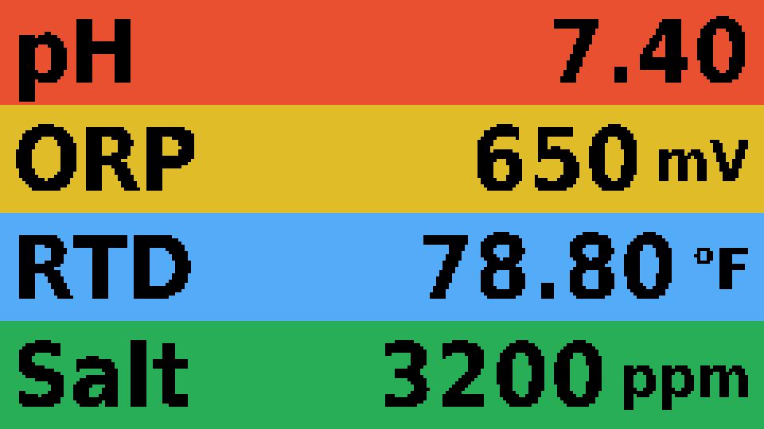
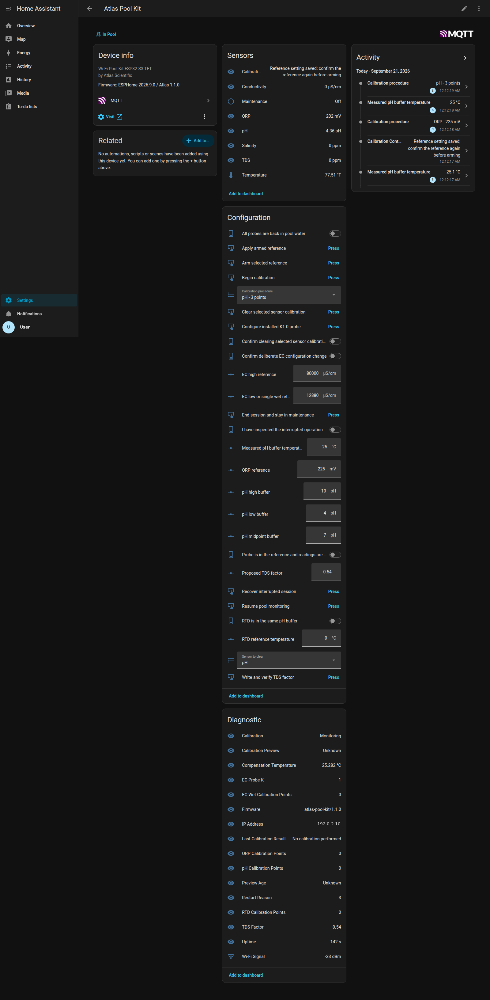
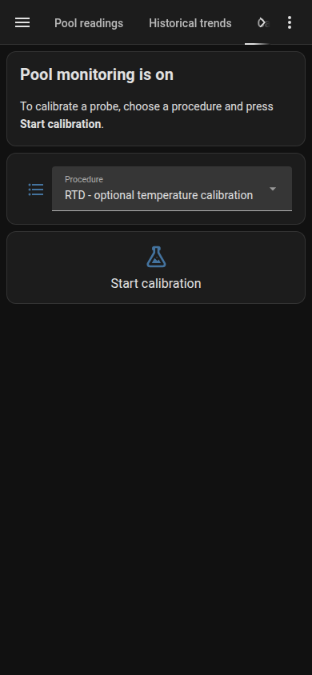
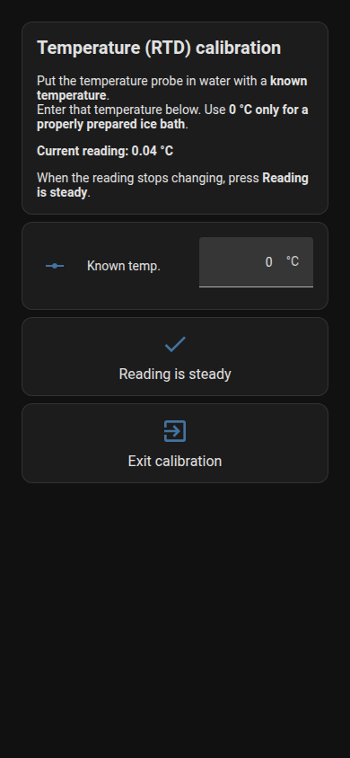

# Atlas Pool Kit — ESPHome firmware

ESPHome firmware for the Atlas Scientific Wi-Fi Pool Kit. It measures pH, ORP,
temperature, conductivity, salinity and TDS, shows them on the kit's TFT and
publishes them to Home Assistant over MQTT. Calibration controls appear in Home
Assistant automatically, with an optional guided calibration dashboard.

This is a sensor monitor only. It has no dosing controls and never commands the
separate Pool Doser. Readings keep working on the display without Home
Assistant, and no cloud service is involved.



## Hardware

- **Atlas Scientific Wi-Fi Pool Kit** with its **Adafruit Feather ESP32-S3 TFT**
  (4 MB flash, 2 MB PSRAM, 240×135 ST7789 display) and its EZO-pH, EZO-ORP and
  EZO-RTD circuits.
- An **EZO-EC** circuit with a **K1.0** conductivity probe, connected to the
  kit's AUX I²C connection.
- Circuits must be in I²C mode at their default addresses. The firmware never
  changes a circuit's address or protocol.

| Circuit | I²C address | Power enable |
| --- | --- | --- |
| EZO-pH | 99 | GPIO12 (active low) |
| EZO-ORP | 98 | GPIO11 (active low) |
| EZO-RTD | 102 | GPIO9 |
| EZO-EC | 100 | GPIO10 (active low) |

The I²C bus uses SDA GPIO42 and SCL GPIO41 at 100 kHz. GPIO21 powers the TFT
and I²C connector; GPIO45 is the backlight. All four circuits are expected:
returning from calibration waits for a fresh reading from all six measurements.

**Power.** In the reference enclosure the kit runs from the doser's 5 V
DIN-rail supply, a Mean Well MDR-20-5. The supply matters for pH: the
original Mean Well HDR-15-5 made the pH reading swing about 0.07 pH from
minimum to maximum on average, and the MDR-20-5 cut that to about a quarter,
roughly 0.025 pH. See the
[Pool Doser BOM](../pool-doser/BOM.md#power-supply).

## What you need

- ESPHome **2026.9.0** (pinned in the repository's `requirements.txt`). See the
  [repository README](../README.md) for installing it; the commands below use
  the repository's `tools/esphome` wrapper, which runs `python -m esphome` with
  the interpreter in `POOL_ESPHOME_PYTHON` (default `python3`).
- An **MQTT 5** broker, such as Mosquitto 2.x, reachable on your network, and
  Home Assistant's MQTT integration connected to the same broker.
- Internet access from the kit to `time.nist.gov` (NTP, UDP 123).
- A data-capable USB-C cable for the first installation.

## 1. Secrets

Copy `secrets.example.yaml` to `secrets.yaml` in the same folder. Git ignores
`secrets.yaml`; never commit it.

| Key | Value |
| --- | --- |
| `wifi_ssid`, `wifi_password` | Your 2.4 GHz Wi-Fi network |
| `mqtt_host`, `mqtt_port` | Broker address and port (normally 1883) |
| `mqtt_username`, `mqtt_password` | A broker account for the kit |
| `atlas_ota_key` | 32 random bytes, base64 encoded, for encrypted updates |

Generate the OTA key once and keep it; every later update needs the same key:

```sh
python3 -c 'import base64,secrets; print(base64.b64encode(secrets.token_bytes(32)).decode())'
```

The MQTT connection is plain TCP without TLS, so use a trusted network and a
dedicated broker account. If your broker uses access control lists, the kit's
account needs:

- **publish** to `pool/atlas_pool/#` and `homeassistant/#` (discovery), and
- **subscribe** to `pool/atlas_pool/command` and `homeassistant/status`.

Home Assistant's own broker account must be able to publish
`pool/atlas_pool/command` and `pool/atlas_pool/live/#`.

## 2. Build and flash

From the repository root:

```sh
./tools/esphome config atlas-pool-kit/atlas-pool-kit.yaml   # validate
./tools/esphome compile atlas-pool-kit/atlas-pool-kit.yaml  # build only
```

**First installation (USB).** Connect the Feather over USB and install the full
image:

```sh
./tools/esphome upload atlas-pool-kit/atlas-pool-kit.yaml --device /dev/ttyACM0
```

Use your actual serial port (`/dev/ttyACM*`, `/dev/cu.usbmodem*` or `COMx`).
If the board does not connect, or it previously ran different firmware, see the
[flashing guide](docs/deployment.md) for download mode, a full erase and the
alternative of flashing `firmware.factory.bin` with ESPHome Web.

**Later updates (Wi-Fi).** Updates are encrypted and authenticated with
`atlas_ota_key` and use TCP port 3232:

```sh
./tools/esphome upload atlas-pool-kit/atlas-pool-kit.yaml --device atlas-pool-kit.local
```

If mDNS does not resolve, use the kit's IP address instead (shown in Home
Assistant as **IP Address**). Finish any calibration and return the probes to
pool water before updating. The [flashing guide](docs/deployment.md) covers
recovery and other details.

The hostname and mDNS name are `atlas-pool-kit`, set by the `device_name`
substitution. The kit has no ESPHome native API, web server or captive portal;
Home Assistant talks to it only through MQTT.

## 3. Home Assistant

Follow the [Home Assistant setup guide](../home-assistant/README.md). It
installs `home-assistant-package.yaml`, the `pool_telemetry` custom component and
the guided calibration dashboard (`home-assistant-dashboard.yaml`).

- The **package is required** for live readings. The firmware publishes raw
  readings; the `pool_telemetry` validator in Home Assistant republishes them on
  `live/<key>` only while they are fresh, and the discovered sensors read that
  stream. The package also adds the guided calibration step sensor, two UI
  shortcuts and recorder exclusions for fast-changing calibration entities.
- The **dashboard is optional**. It arranges the same discovered entities into
  Pool readings, Historical trends, Calibration and Advanced setup views. Keep
  `dashboard_path: atlas-pool-kit/calibration` in `atlas-pool-kit.yaml` when you
  use it, so the device page's **Visit** link opens Calibration. Remove that line
  if you do not install the dashboard; the device controls still work.

Once the kit connects to the broker, the **Atlas Pool Kit** device appears
under the MQTT integration. Add it before assigning an area so its entity IDs
stay as listed below.

### Entities

All entity IDs start with `atlas_pool_`.

| Reading | Unit | Circuit |
| --- | --- | --- |
| `sensor.atlas_pool_ph` | pH | EZO-pH |
| `sensor.atlas_pool_orp` | mV (zero and negative are valid) | EZO-ORP |
| `sensor.atlas_pool_temperature` | °F | EZO-RTD |
| `sensor.atlas_pool_conductivity` | µS/cm | EZO-EC |
| `sensor.atlas_pool_salinity` | ppm (Atlas salinity × 1,000) | EZO-EC |
| `sensor.atlas_pool_tds` | ppm | EZO-EC |

A reading becomes unavailable if it is older than 20 seconds, fails, or the kit
is in calibration. Home Assistant keeps hourly mean/minimum/maximum statistics
for all six.

Diagnostic sensors: `calibration` (status, with diagnostics as attributes),
`preview`, `preview_age`, `compensation`, `tds_factor`, `k`, `firmware`, `ip`,
`rssi`, `uptime`, `reset_reason`, `ph_calibration`, `orp_calibration`,
`rtd_calibration`, `ec_calibration`, `last_calibration`, `control_result`,
`ph_acid_slope`, `ph_base_slope` and `ph_zero_offset`, plus
`binary_sensor.atlas_pool_maintenance`.

The three slope sensors report the EZO-pH `Slope,?` query (Atlas EZO-pH
datasheet pp. 25, 51, 68–70): acid and base response as a percentage of an
ideal probe, and the zero-point offset in mV. Atlas expects a healthy probe
above 95% with an offset within ±5 mV; above 10 mV causes noticeable errors.
The circuit updates slope only when calibrated, so the kit reads it at startup
and after each pH calibration point. It is a read-only query.

The 27 configuration controls:

| Domain | IDs after `atlas_pool_` |
| --- | --- |
| `select` | `calibration_method`, `clear_sensor` |
| `number` | `ph_mid`, `ph_low`, `ph_high`, `orp_reference`, `ec_low`, `ec_high`, `rtd_reference`, `buffer_temperature`, `tds_factor` |
| `switch` | `reference_ready`, `probes_returned`, `rtd_in_buffer`, `recovery_acknowledged`, `ec_config_confirmed`, `clear_confirmed` |
| `button` | `begin`, `arm`, `apply`, `cancel`, `return`, `resume`, `initialize_k1`, `configure_monitoring`, `set_tds_factor`, `clear` |



## 4. Calibration

On first boot the kit starts monitoring immediately; calibration is not required
to see readings. Existing calibration stays in the EZO circuits, and the
firmware never writes calibration on its own.

Guides:

- [pH, lab-grade probe: 7 → 4 → 10](docs/calibration-ph.md)
- [ORP, gold probe: 225 mV](docs/calibration-orp.md)
- [Conductivity, K1.0 probe: dry → 12,880 → 80,000 µS/cm](docs/calibration-ec.md)
- [Temperature (RTD), optional](docs/calibration-rtd.md)

With the guided dashboard, open **Atlas Pool Kit → Visit → Calibration**:

1. Choose a procedure and press **Start calibration**.
2. Follow the current step: enter its reference value, wait for the reading to
   settle, then press **Reading is steady → Save calibration**.
3. To finish or stop, put every probe back in pool water, press **Exit
   calibration** and confirm.

| Idle | RTD step |
| --- | --- |
|  |  |

Without the dashboard, use the device page's **Configuration** controls: select
the procedure, press **Begin calibration**, set the reference, turn on **Probe is
in the reference and readings are stable**, then **Arm selected reference** and
**Apply armed reference** within ten seconds. To exit, turn on **All probes are
back in pool water** and press **Resume pool monitoring**. **Calibration Control
Result** explains any rejected command.

How calibration behaves:

- Only one session runs at a time. All six readings are unavailable during
  calibration, and the display shows the live preview.
- You judge when a reading is steady; the firmware does not assume stability
  from a timer. Changing a reference disarms a prepared write, and confirmations
  reset after each accepted operation, on restart and on disconnection.
- After each point the firmware reads back the circuit's status and the
  reading. Agreement checks are ±0.10 pH, ±10 mV ORP, ±0.3 °C RTD and the larger
  of ±2 % or ±5 µS/cm for EC. These are post-write sanity checks, not accuracy
  certificates. The EC low point is staged by the circuit and only takes effect
  with the high point.
- Saved points stay saved when you exit early; an unfinished procedure is not a
  completed calibration.
- If a write is interrupted while the kit stays powered, inspect the status and
  preview, turn on **I have inspected the interrupted operation** and press
  **Recover interrupted session**. Nothing is retried automatically. After a
  restart there is no session to resume: check the calibration point counts and
  start a new procedure if needed.
- Exiting checks the circuit configuration and waits for a fresh cycle of all
  six readings before monitoring resumes.

**Advanced setup** also offers **Configure installed K1.0 probe**, **Write and
verify TDS factor**, **Configure monitoring settings** (RTD Celsius scale and
logging off, EC output fields) and **Clear selected sensor calibration**. Each
needs its confirmation switch (**Confirm deliberate circuit configuration
change**, or **Confirm clearing selected sensor calibration** for clearing),
verifies the result, and skips values that already match. Do not clear calibration as a routine step.

## Display

The TFT is landscape with four rows: pH, ORP and temperature (°F), then a row
that rotates conductivity, salinity and TDS every five seconds. Values use
28-pixel bold text with smaller units. A failed or stale reading shows
**Unavailable**. During calibration the screen shows **MAINTENANCE**, the
sensor and step, the live preview and the latest result.

A full reading cycle takes about five seconds. Every circuit transaction has a
deadline, so one faulty circuit cannot stop the others.

## Measurement notes

- The RTD is read first and its temperature is used for pH and EC compensation.
  Keep the RTD and EC probe in the same water. Without a valid RTD reading,
  compensation assumes 25 °C and temperature shows unavailable.
- Temperature is Celsius inside the firmware and on the circuits; the display
  and MQTT readings use Fahrenheit. The normal accepted range is −40…80 °C.
- Salinity is the EC circuit's PSU value × 1,000, shown as whole ppm.
- The firmware checks the EC circuit's stored probe K and withholds EC readings
  if it is not 1.0. The stored TDS factor is read and kept; the UI's 0.54 is only
  a proposed value. TDS is an estimate and is not salt ppm.

## Time

The kit synchronizes with `time.nist.gov` at startup, on each Wi-Fi connection
and every five minutes; no other time server is used. Each measurement carries
its acquisition time (`measured_at_ms`, Unix milliseconds), and Home Assistant
rejects readings that are 20 seconds old or more, or over two seconds in the
future. The Home Assistant host just needs a normally synchronized clock; no
special configuration is required.

## Flash writes

Normal monitoring, reconnects and restarts do not write flash. The ESP32 saves
only deliberate changes: maintenance (calibration) intent and changed reference
numbers. Calibration progress, procedure selection and confirmations are RAM
only. EZO circuits store calibration and configuration only when you confirm a
calibration or configuration action; startup only queries them.

## MQTT topics

The default device ID is `atlas_pool` (`device_id` under `atlas_pool:`). Topics
are under `pool/atlas_pool/`:

| Suffix | Direction | Contents |
| --- | --- | --- |
| `state` | Kit → HA | All six readings or JSON null (°F, salinity ppm); not retained |
| `reading/<key>` | Kit → HA | One newly acquired reading or null; input to the HA validator |
| `live/<key>` | HA validator → HA | Validated fresh reading or null; used by the sensors |
| `availability` | Kit → HA | Retained `online`/`offline`, with an `offline` last will |
| `diagnostics` | Kit → HA | Calibration state, faults, compensation, identity and control values; not retained |
| `command` | HA → kit | Named calibration/configuration operations; not retained |

Discovery configurations are retained under
`homeassistant/<domain>/atlas_pool/<key>/config` and republished when a
message arrives on `homeassistant/status`. Measurements use QoS 0 and are never
queued in the MQTT outbox; discovery and availability use retained QoS 1.
Wi-Fi or broker outages do not reboot the kit.

Measurement messages include `measured_at_ms`, `timestamp_ms`, the boot ID,
`clock_epoch`, `clock_healthy` and `time_source: time.nist.gov`. Diagnostics
carry `diagnostic_version: 2` and `configuration_ok`.

Commands are JSON with `boot`, `token`, `session`, `issued`, a unique `id` and
`action`. Controls use `action: set` with `key` and `value`, or a button name as
the action. Commands expire after ten seconds, tokens are single use, and
retained, oversized, malformed, previous-boot and out-of-order commands are
refused. There is no raw EZO command console, factory reset or address change.

The device ID is also the MQTT client ID, the Home Assistant device identifier
and the prefix of each entity's unique ID; entity IDs are `atlas_pool_<key>`
regardless. The package, dashboard and validator are written for one kit.

## Source layout

| Path | Contents |
| --- | --- |
| `atlas-pool-kit.yaml` | ESPHome configuration: pins, time, OTA and display |
| `components/atlas_pool/` | Platform-independent engine (`core.h`), controls and discovery, and the ESPHome I²C/MQTT adapter |
| `home-assistant-package.yaml` | Required HA package: freshness validator, guided step sensor, shortcuts, recorder exclusions |
| `home-assistant-dashboard.yaml` | Optional guided dashboard |
| `docs/` | Calibration and flashing guides |
| `tests/` | C++ engine tests and Home Assistant integration tests |
| `fonts/` | DejaVu fonts for the display (see `fonts/LICENSE.txt`) |

## Tests

From the repository root:

```sh
./tools/test-atlas              # C++ tests with sanitizers and Python checks
./tools/test-atlas --container  # also validates against Home Assistant in Docker
```

`--container` starts a throwaway, offline Home Assistant container
(`ghcr.io/home-assistant/home-assistant:stable`, or the image in
`POOL_HA_IMAGE`). It mounts nothing and never touches a running installation.
