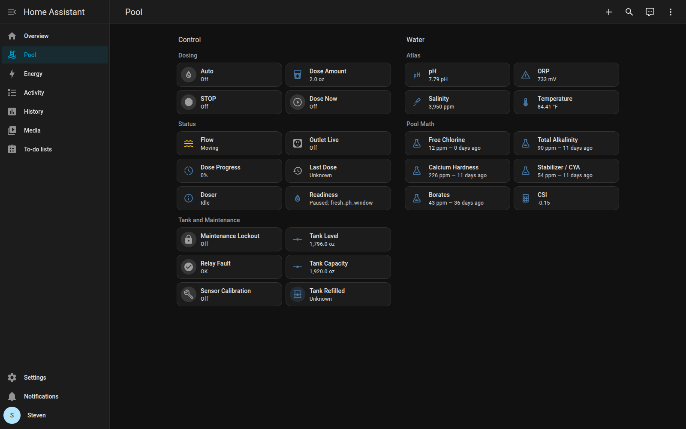

# Home Assistant setup

Everything Home Assistant needs is in this repository. These steps add a
**Pool** dashboard to the sidebar: grouped controls and doser status on the
left, water readings on the right, every tile in a fixed order. They add files and
dashboards only; your existing dashboards, default screen and settings stay as
they are.



## Requirements

- Home Assistant **2026.9** or later (container or HA OS), with its `/config`
  folder reachable for copying files.
- An MQTT broker for the Atlas Pool Kit, with MQTT 5 and password logins. On
  HA OS, use the Mosquitto add-on. With Docker, see [MQTT broker](#mqtt-broker-docker).
- Both devices flashed from this repository:
  [Atlas Pool Kit](../atlas-pool-kit/README.md) and
  [Pool Doser](../pool-doser/README.md). Keep their default names.
- Optional: a [Pool Math](https://www.troublefreepool.com/) share link for the
  test readings. Without it those five tiles and CSI show Unknown.

## MQTT broker (Docker)

[`mosquitto/`](mosquitto) runs Mosquitto next to a Home Assistant container on
the `home-assistant_default` Docker network. Copy the folder somewhere outside
this repository, then:

```sh
cp .env.example .env            # set MQTT_BIND_ADDRESS to this computer's LAN address
docker run --rm -it -v "$PWD/config:/mosquitto/config" eclipse-mosquitto:2.1.2-alpine \
  sh -c 'mosquitto_passwd -c /mosquitto/config/passwords home_assistant &&
         mosquitto_passwd /mosquitto/config/passwords atlas_pool &&
         chown 1883:1883 /mosquitto/config/passwords && chmod 600 /mosquitto/config/passwords'
docker compose up -d
```

`home_assistant` is Home Assistant's login (broker host `eclipse-mosquitto`, port
1883); `atlas_pool` is the Atlas Pool Kit's login (`mqtt_host` is the LAN address
above). Reserve that address in your router; no port forwarding is needed.

## 1. Copy files

| From this repository | To Home Assistant |
| --- | --- |
| `home-assistant/secrets.example.yaml` | add its line to `/config/secrets.yaml` |
| `atlas-pool-kit/home-assistant-package.yaml` | `/config/packages/atlas_pool.yaml` |
| `pool-doser/pool-doser-home-assistant.yaml` | `/config/packages/pool_doser.yaml` |
| `home-assistant/packages/pool_math.yaml` | `/config/packages/pool_math.yaml` |
| `home-assistant/custom_components/pool_tank/` | `/config/custom_components/pool_tank/` |
| `home-assistant/custom_components/pool_telemetry/` | `/config/custom_components/pool_telemetry/` |
| `home-assistant/dashboards/pool.yaml` | `/config/dashboards/pool.yaml` |
| `atlas-pool-kit/home-assistant-dashboard.yaml` | `/config/dashboards/atlas-pool-kit.yaml` |

Then add the `homeassistant:` and `lovelace:` sections from
[`configuration.yaml`](configuration.yaml) to your own `/config/configuration.yaml`.
If it already has either section, add the `packages:` line or the two dashboard
entries inside the existing one. In `secrets.yaml`, set `pool_math_url` to your
share link in its `.json` form, or delete `packages/pool_math.yaml` if you do not
use Pool Math.

Check the configuration (**Developer tools → YAML → Check configuration**)
and restart Home Assistant.

## 2. Add the devices

Add the devices **before** assigning them to any area: Home Assistant 2026 puts
the area name into new entity IDs, and the dashboards expect the plain IDs such
as `sensor.pool_doser_status`.

1. **Settings → Devices & services → Add integration → MQTT**, pointing at your
   broker. The Atlas Pool Kit appears by itself once it connects.
2. **Settings → Devices & services → Add integration → ESPHome**, enter the Pool
   Doser's address and the `api_encryption_key` from `pool-doser/secrets.yaml`.

## 3. Open the Pool dashboard

Select **Pool** in the sidebar. The **Sensor Calibration** tile opens the guided
Atlas calibration dashboard, which stays out of the sidebar. To have Pool open
first, you can optionally set it as the default under **Settings → Dashboards**.

## Result

**Control** has three groups: **Dosing** (Auto, STOP, Dose Amount, Dose Now),
**Status** (flow, outlet live, dose progress, last delivered dose, doser
status, readiness) and **Tank and Maintenance** (maintenance lockout, relay
fault and sensor calibration beside tank level, capacity and refilled). **Water** has two groups: **Atlas**, the four live
readings (pH, ORP, salinity, temperature), and **Pool Math**, the tests (free chlorine,
total alkalinity, calcium hardness, stabilizer, borates) with their test age, and
CSI last.

| Tile | Tap | Icon |
| --- | --- | --- |
| STOP | Stops the dose and turns Auto Off immediately | Same |
| Dose Now | Doses the Dose Amount after confirmation | Same |
| Tank Refilled | Sets Tank Level to capacity after confirmation | Same |
| Relay Fault | Details and history | Clears a latched fault after confirmation (requires Maintenance Lockout) |
| Sensor Calibration | Opens Atlas calibration | Same |
| Others | Details, history and settings | Toggles Auto and Maintenance Lockout |

Rarely changed doser settings, such as pump rating and calibration factor, are on
the Pool Doser device page under **Settings → Devices & services → ESPHome**.

Turning Auto Off stops new automatic doses; a dose already running finishes.
STOP is the only control that cancels a running dose.

A new installation starts with Auto Off, a 1,920 oz capacity and an unknown level.
Set **Tank Capacity** and **Tank Level** once, then turn Auto On when ready.
